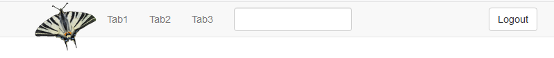

<!-- README.md is generated from README.Rmd. Please edit that file -->

```{r, include = FALSE}
knitr::opts_chunk$set(
  collapse = TRUE,
  comment = "#>",
  fig.path = "man/figures/README-",
  out.width = "100%"
)
```

# shinynavbar

<!-- badges: start -->
[](https://www.tidyverse.org/lifecycle/#maturing)
[](https://www.gnu.org/licenses/gpl-3.0.en.html)
<!-- badges: end -->

This is a reimplementation of Shiny's navbarPage and tabset functionality with more features and 
flexibility.




## Installation

You can install shinynavbar with:

``` r
# install.packages("devtools")
devtools::install_github("markusdumke/shinynavbar")
```

Here is an example:

```r
library(shiny)
library(shinynavbar)

ui <- bootstrapPage(
  tags$head(tags$style(".active a {background-color: #f8f8f8 !important}
                       .navbar-brand {padding: 0 0 !important}")),
  navbar(position = "static-top",
         ## use image as brand
         navbarHeader(navbarBrand("Brand")),
         ## these elements appear on the right
         navbarHeader(navbarButton("Logout"),
                      navbarCollapseButton(),
                      pull = "right"),
         ## the classical navbar with a text form
         navbarCollapse(navbarNav(navTab("Tab1"),
                                  navTab("Tab2"),
                                  navTab("Tab3")),
                        navbarForm(textInputNoLabel("text")))
  ),
  div(
    class = "container-fluid",
    divTabContent(
      divTabPane("Tab1", h2("This is tab1")),
      divTabPane("Tab2", h2("This is tab2")),
      divTabPane("Tab3", h2("This is tab3"))
    )
  )
)

server <- function(input, output, session) {
  session$onSessionEnded(stopApp)

  observeEvent(input$navbar, {
    print(input$navbar)
  })

  observeEvent(input$Logout, {
    print("Logged out")
  })

  ## clicked on brand image
  observeEvent(input$Brand, {
    print("Brand")
  })
}

shinyApp(ui, server)
```
